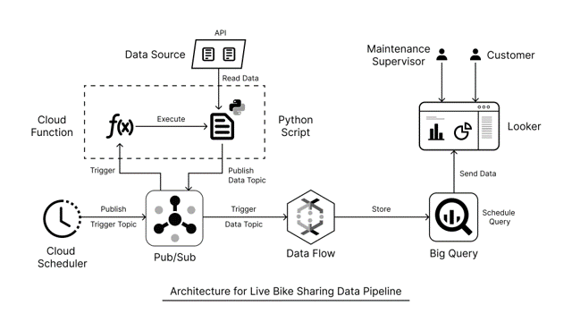

# BikeShare-Data-Streaming-Pipeline

A big data pipeline for streaming, processing, and visualizing bike share data.

*Techonology:*
- Cloud Scheduler (GCP)
- Pub/Sub (GCP)
- Cloud Function (GCP)
- Python3 (Libraries – requests, pandas, google.cloud pubsub, time, os)
- DataFlow (GCP)
- BigQuery (GCP)
- Looker Studio

For detailed report and implementation of the pipeline refer to: Data_Engineering_2_project_report.pdf

---

## User Stories

- As a Maintenance Supervisor, I want to schedule maintenance based on bike usage data, so that we can minimize downtime and maintain a high level of service quality.

- As a customer, I want to find the nearest bike station to the location entered using a map interface, so that I can see the number of bikes available.

---

## Data Source

Data Source: **Capital Bikeshare**

- It is the “Bikesharing” or the bikes for rent publicly available in Washington DC data.
- The source provides system data in two forms:
    - Trip History Data (Zipped CSVs)
    - Real-Time System Data
- **Data features:** Trip History are entirely different from the data features available in the Real-Time System Data.
- **Project Focus:** As this project focuses on stream processing, Real-Time System Data was chosen.

---

## APIs

- [GET] https://gbfs.lyft.com/gbfs/2.3/dca-cabi/en/station_information.json
- [GET] https://gbfs.lyft.com/gbfs/2.3/dca-cabi/en/station_status.json

---

## Features

- Station ID
- Timestamp
- Name
- Latitude
- Longitude
- Number of Bikes Available
- Number of E-Bikes Available
- Number of Docks Disabled
- Number of Bikes Disabled

---

## Dashboard

---

## Problems faced

- Discrepancy between the values of certain data points between the two APIs.
- Lack of proper API documentation resulting in increased time needed for understanding. 
- GCP Cloud shell was not being provisioned hence had to resort to using GUI for performing all actions.
- Dataflow VM was not getting created, after debugging it was found out that “Europe-West3 (Frankfurt)” region was the issue, thus had to deploy in another region.
- Lack of experience with Looker Studio, thus leading to increased time for dashboard creation.  

## Future score

- Use Apache Beam with Dataflow, currently Big Query only supports batch processing, and its functionality is limited. Using Apache Beam will enable us achieve stream processing and calculate aggregations in real-time.
- Use a visualization tool that gets refreshed automatically as Looker Studio needs to be refreshed manually to see changes in the free version.

---

## References

1. https://capitalbikeshare.com/system-data
2. https://cloud.google.com/scheduler/docs
3. https://cloud.google.com/pubsub/docs
4. https://cloud.google.com/functions/docs
5. https://docs.python.org/3/
6. https://pypi.org/project/requests/
7. https://pandas.pydata.org/docs/
8. https://cloud.google.com/bigquery/docs
9. https://cloud.google.com/dataflow/docs
10. https://developers.google.com/looker-studio
11. https://medium.com/@dogukannulu/gcp-cloud-engineering-project-part-1-
12. https://www.youtube.com/watch?v=6ahfcLa3oG8

---